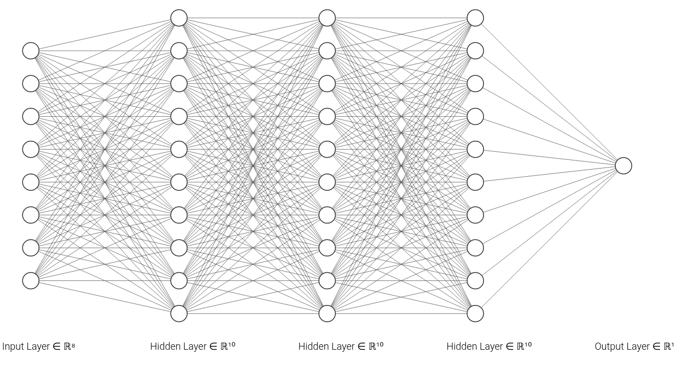

# 🧠 Comparando parametros 👾

### Test_1 = MSE: 55.76 ( 50 epochs, sem normalizacao de dados e estrutura abaixo )

### Test_2 = MSE: 52.25 ( 50 epochs, normalizacao de dados e estrutura abaixo )

### Test_2 = MSE: 52.25 ( 100 epochs, normalizacao de dados e estrutura abaixo )

### Test_4 = MSE: 43.96 ( 50 epochs, normalizacao de dados e estrutura abaixo )

